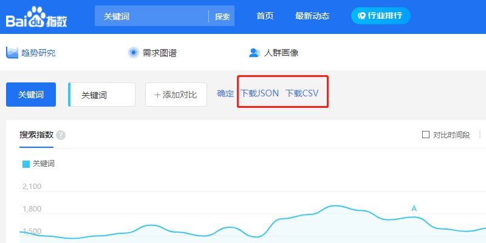

# 介绍

这是一个下载百度指数数据的浏览器插件

# 安装

方式一：
- 下载并解压
- 浏览器 -> 扩展中心 -> 加载包

方式二：
- 下载`crx`文件直接拖入浏览器
- 下载地址：`https://github.com/taoran1401/baiduIndexDownloader/releases/download/v1.0.0/baiduIndexDownloader.crx`

# 使用

在百度指数页面点击按钮`下载JSON`和`下载CSV`即可

# 注意(重要)

一次最好只下载一年的数据，且不要跨年下载；否则可能出现数据不全的情况
